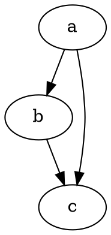

以下是一些使用方式,提供备用查询,详情可以查看 gastby-remark[^1].

## 脚注

比如上面的 gastby-remark 旁边有一个[^1],这是一个脚注,引用到了文章最下面的一块区域,相当于注解或者引用出处,点击注脚就直达底部,点击底部返回图标可以再返回当前位置,使用方式很简单:

```html
[^1]
```

以此类推还有`[^2]`,`[^3]`...再到底部书下面这段内容:

```html
[^1]: [首页](www.quietboy.net) [^2]: 解释一下这是什么...
```

## 图片

最简单的是引用`static`中的图片,比如有`/static/download/about.jpg`图片,那么使用如下:

```html

```

渲染结果为:


由于是引用的`static`文件夹中的图片,因此此图片并没有任何处理,引用的是原文件.

下面是使用 gatsby-remark-images[^2]插件,提供渐进式的图片加载,类似于 medium[^3]中的模糊化图片加载方式(先加载占位图,稍后再加载清晰图片),缺点是只支持`png`,`jpeg`两种类型图片:

```

```


## 自定义组件

顾名思义也就是可以在 markdown 文件中使用 react 组件,这类支持需要自己定义,比如这篇文章[^4]中介绍的一个计数组件.

需要注意的是组件内部如果由 div 标签包裹,**那么引用的时候需要手动嵌套一个`div`**,否则会导致 React 警告,因为 HTML 规范不建议在`p`标签中包裹块级标签,比如你在 markdown 文件中这样使用:

```html
<render-image></render-image>
```

那么你会发现渲染出来的组件内容是由一个标签`p`包裹起来的,React 在开发模式下会发出警告:`Warning: validateDOMNesting(...): <div> cannot appear as a descendant of <p>`

因此组件包含 div 这类块级内容的时候最好如下使用避免警告:

```html
<div><render-image></render-image></div>
```

## 代码

与其它代码块使用类似,增加了以下几点功能:

### 1.高亮代码行

源代码:

    ```js
    import React from "react"
    // highlight-next-line
    import ReactDOM from "react-dom"

    const name = `Brian` // highlight-line

    ReactDOM.render(
      <div>
        {/* highlight-range{1-2} */}
        <h1>Hello, ${name}!</h1>
        <h2>Welcome to this example</h2>
      </div>,
      document.getElementById(`root`)
    )
    ```

渲染后:

```js
import React from 'react';
// highlight-next-line
import ReactDOM from 'react-dom';

const name = `Brian`; // highlight-line

ReactDOM.render(
	<div>
		{/* highlight-range{1-2} */}
		<h1>Hello, ${name}!</h1>
		<h2>Welcome to this example</h2>
	</div>,
	document.getElementById(`root`)
);
```

还有`highlight-start`与`hightlight-end`,可以方便的整个包裹起来.另外还有可以在代码头加` ```js{1,3-4} `来控制第一行,第三到四行高亮.

而`highlight-range`使用的是一个 parse-numeric-range 库[^5]来进行格式化获取行数.

### 2.隐藏代码行

源代码:

    ```js
    /* hide-range{1-3} */
    import React from "react"
    import ReactDOM from "react-dom"

    const name = `Brian`

    // hide-next-line
    ReactDOM.render(
      <div>
        <h1>Hello, ${name}!</h1>
        <h2>Welcome to this example</h2>
      </div>,
      document.getElementById(`root`) // hide-line
    ) // hide-line
    ```

渲染后:

```js
/* hide-range{1-3} */
import React from 'react';
import ReactDOM from 'react-dom';

const name = `Brian`;

// hide-next-line
ReactDOM.render(
	<div>
		<h1>Hello, ${name}!</h1>
		<h2>Welcome to this example</h2>
	</div>,
	document.getElementById(`root`) // hide-line
); // hide-line
```

gatsby 还有一款可以引用外部代码文件的插件[^6],个人觉得需求不大,因此需要的同学可以自己手动安装.

### 3.代码行数显示

代码块头增加`{numberLines: true}`

    ```yaml{numberLines: true}
    # crate page config
    createPageConfig:
      activeLayout: posts
      posts: # blog posts layout, this is default layout
        list: posts-list.tsx
        listPath: /posts/page/:page
        detail: posts-detail.tsx
        detailPath: /posts/:date/:title
        tag: posts-tag.tsx
        tagPath: /tags/:tag
    ```

_可以将`true`改为数字,代表开始行数号_

```yaml{numberLines: 10}
# crate page config
createPageConfig:
  activeLayout: posts
  posts: # blog posts layout, this is default layout
    list: posts-list.tsx
    listPath: /posts/page/:page
    detail: posts-detail.tsx
    detailPath: /posts/:date/:title
    tag: posts-tag.tsx
    tagPath: /tags/:tag
```

## KaTeX

使用 KaTeX 绘制数学方程,有以下两种方式:

1.使用`$`开头和结尾

```
$a^2 + b^2 = c^2$
```

渲染为:

$a^2 + b^2 = c^2$

2.使用`$$`开头和结尾

```
$$
a^2 + b^2 = c^2
$$
```

渲染为:

$$
a^2 + b^2 = c^2
$$

## Graphviz

使用的是 gatsby-remark-graphviz 插件[^7]

    ```dot
    digraph graphname {
      a -> b;
      b -> c;
      a -> c;
    }
    ```



更多使用方式点击这里[graphviz](https://using-remark.gatsbyjs.org/graphviz/)

[^1]: [gatsby-remark](https://using-remark.gatsbyjs.org/)
[^2]: [gatsby-remark-images](https://www.gatsbyjs.org/packages/gatsby-remark-images/)
[^3]: [medium](www.medium.com)
[^4]: [custom-components](https://using-remark.gatsbyjs.org/custom-components/)
[^5]: [parse-numeric-range](https://www.npmjs.com/package/parse-numeric-range)
[^6]: [gatsby-remark-embed-snippet](https://www.gatsbyjs.org/packages/gatsby-remark-embed-snippet/)
[^7]: [gatsby-remark-graphviz](https://www.gatsbyjs.org/packages/gatsby-remark-graphviz/)
